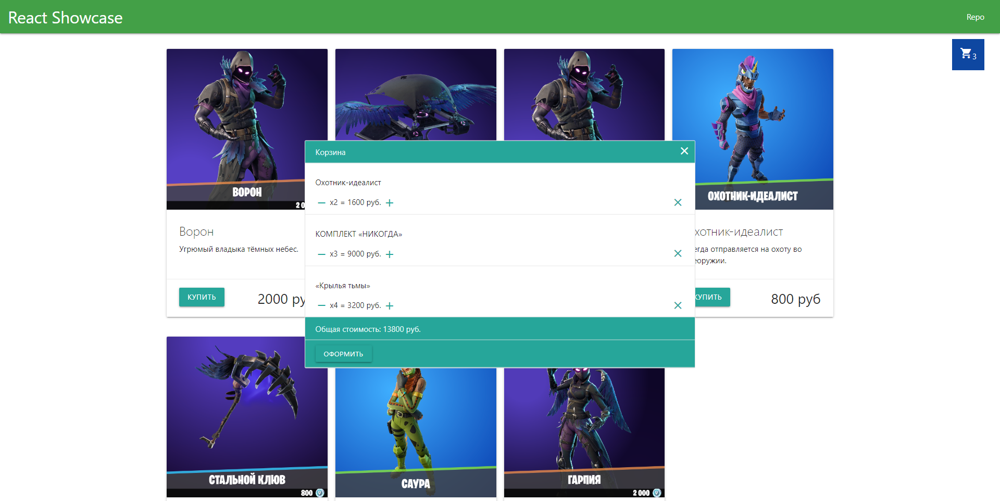

# Приложение "Витрина" с опцией добавления товара в корзину и редактирования его количества на React и Materialize CSS

**Для запуска приложения на локальном устройстве необходимо скачать репозиторий и выполнить в терминале следующие команды**

-   Установить зависимости `npm i`
-   Запустить режим разработки `npm start`

**Для запуска финальной сборки проекта**
Выполнить `npm run build`

