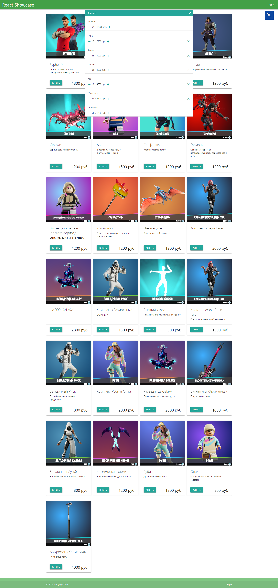

## React приложение "Витрина"

 - ### Проект доступен по ссылке - https://vadim-strakhov.github.io/react_showcase/
 - ### В проекте использован бесплатный API - https://fortniteapi.io/
 - ### В проекте реализован функционал добавления товаров в корзину. Можно редактировать колличество товара из корзины с пересчетом конечной стоимости или полностью удалить его
 - ### Технологии - `react`, `css`, `ajax`, `fetch-api`, `materialize-css` 

